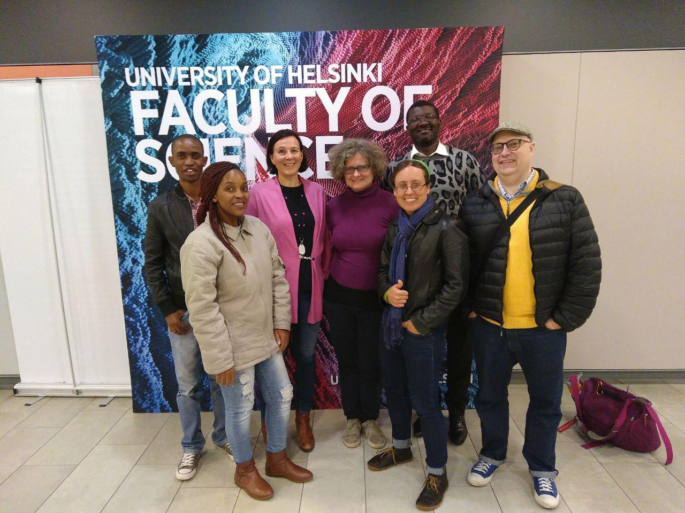
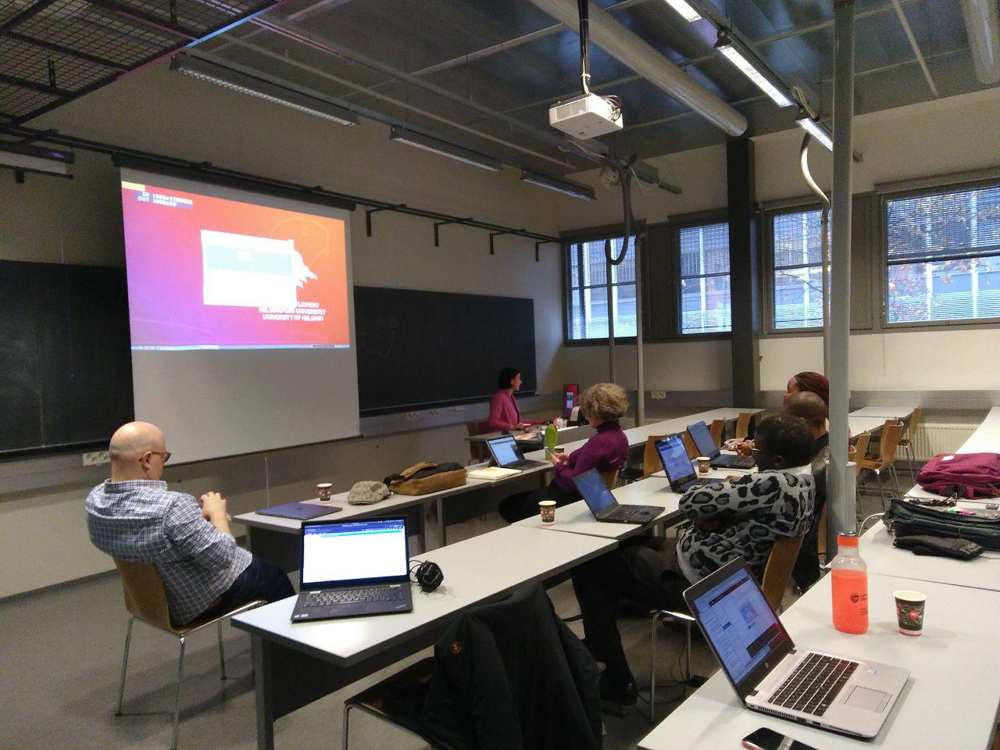

# Helsinki design hack2

The primary outcome of this design hack effort were:
 - The development of PySOSA (Now hosted [here](https://github.com/landrs-toolkit/PySOSA))
 - And the refinement of initial API designs.   This has led to the creation of the [LANDRS-Toolkit org on Github](https://github.com/landrs-toolkit) where API modules are being developed in independent repos for optimal reuse.  

With thanks for all attendees at the hack, and particularly our host Prof Laura Ruotsalainen of the University of Helsinki:

Ms Magagna Barbara, Umweltbundesamt GmbH 
Ms Wame Raseonyana, University of Botswana
Mr Badisa Mosesane, University of Botswana
Dr Micheal Tuape, University of Botswana
Dr Charles Vardeman, University of Notre Dame

