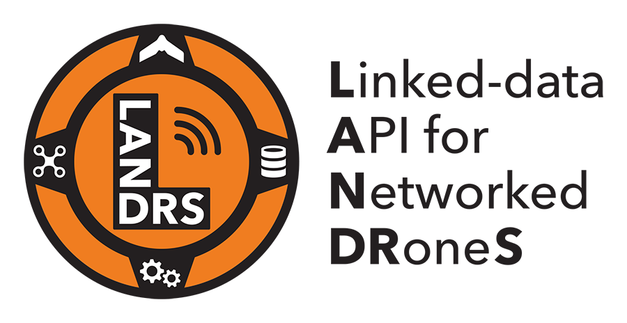
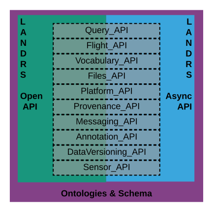
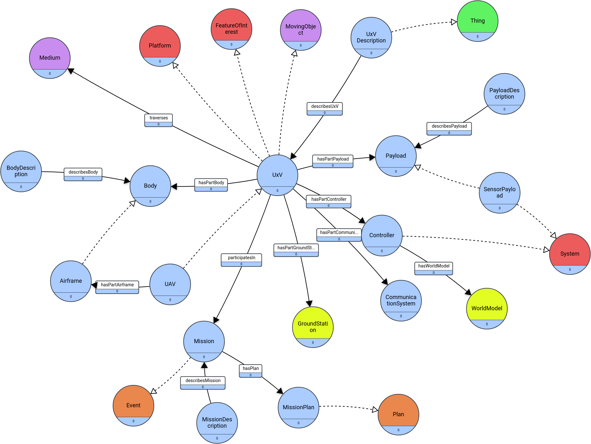

# README
LANDRS: Linked-data API for Networked DRoneS
An API for building drone data management tools that facilitate FAIR data.

## Design diagram1:

## Design diagram2:

Based lossely on this rough model [dronething.json](https://github.com/crcresearch/LANDRS/blob/master/models/dronething.json)

## Design Hack1 at ESIP Summer Meeting
- Apply for funding [here](https://docs.google.com/forms/d/e/1FAIpQLScLsOjksanfSHAoUzZFRHltXHXV_7RDVHrYFeqr7W0zWl9BwQ/viewform) by Sunday 9 june 2019
- Agenda bashing happening [here](https://github.com/crcresearch/LANDRS/blob/master/DesignDocs/DesignHack1/Agenda.md)
- ESIP Summer Meeting Program [here](https://2019esipsummermeeting.sched.com/)

##Contact
[Slack](https://join.slack.com/t/landrs/shared_invite/enQtNjI0MTI2MjgwODAyLWQ0MDY1M2M2Mjk0NTMxNGEzZTM3NDRhODdjNTgyNTA0NzIzMjA5M2EwNDdjM2ExYzc3YzI5OGI1ZTU2YWQyNTA)
ESIP Drone Cluster [mailing list](https://lists.esipfed.org/mailman/listinfo/esip-drone)
RDA sUAS data IG [mailing list](https://www.rd-alliance.org/groups/small-unmanned-aircraft-systems%E2%80%99-data-ig)

##Telcos:
- 6 June 2019 (regular ESIP cluster call)
- 20 June 2019
- 11 July 2019

